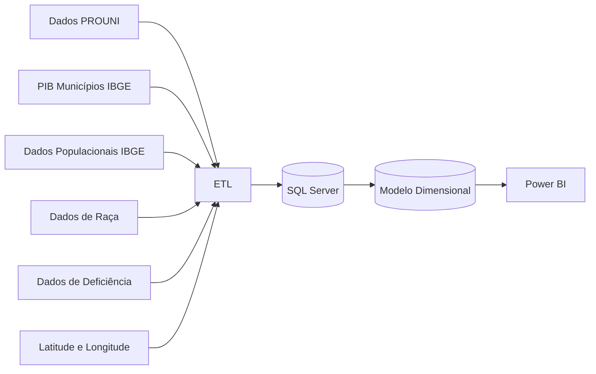

# Análise Socioeconômica das Bolsas do PROUNI

## Sobre o Projeto

O objetivo do projeto foi analisar a distribuição das bolsas do Programa Universidade para Todos (PROUNI) e verificar seu impacto na inclusão social e no acesso ao ensino superior, utilizando técnicas de ETL, modelagem dimensional e visualização de dados.
A análise considerou dados de bolsas concedidas entre 2005 e 2019, além de informações socioeconômicas provenientes do IBGE.

---

## Objetivos

- Avaliar a distribuição das bolsas do PROUNI no território nacional.
- Analisar o perfil socioeconômico dos beneficiários.
- Verificar a participação de minorias e grupos socialmente vulneráveis.
- Identificar cursos, universidades e modalidades mais procuradas.
- Investigar possíveis relações entre PIB municipal e acesso ao ensino superior por meio do PROUNI.

---

## Arquitetura da Solução

---

## Fontes de Dados

| Fonte | Descrição |
|---------|------------|
|[PROUNI (Kaggle)](https://www.kaggle.com/lfarhat/brasil-students-scholarship-prouni-20052019) | Bolsas concedidas entre 2005 e 2019 |
| IBGE | PIB dos municípios |
| IBGE | Dados populacionais |
| IBGE | Dados de raça |
| IBGE | Dados de deficiência |
| Open Source | Latitude e longitude dos municípios |

---

## Modelagem de Dados

O projeto foi desenvolvido utilizando modelagem dimensional no formato Star Schema.

### Tabela Fato

- FATO_BOLSAS_GERAL

### Dimensões

- Beneficiário
- Características do Beneficiário
- Tipo de Bolsa
- Universidade
- Curso
- Modalidade
- Data de Solicitação
- Município
- Região
- PIB
- População Geral

---

## Processo de ETL

Durante a etapa de transformação foram realizados:
- Padronização dos nomes dos cursos.
- Correção dos dados de sexo dos beneficiários.
- Recalculo das idades dos estudantes.
- Criação de chaves de integração entre municípios.
- Padronização de faixas etárias.
- Integração de dados econômicos e populacionais.
- Tratamento e normalização dos dados do Censo.

---

## Dashboards Desenvolvidos

### Dashboard Estratégico

Visão geral da distribuição das bolsas:
- Cursos mais procurados
- Universidades mais procuradas
- Tipos de bolsas
- Turnos mais solicitados
- Total de solicitações

### Dashboard Analítico

Análise geográfica com:
- Mapa de distribuição das bolsas
- Filtros dinâmicos
- Drill-down por município
- Segmentação por perfil dos beneficiários

### Dashboard Operacional

Análise detalhada de:
- Sexo
- Raça
- Faixa etária
- Pessoas com deficiência
- Distribuição por município
- Relação entre PIB e quantidade de bolsas

---

## Principais Tecnologias

- SQL Server
- T-SQL
- Power BI
- Power Query
- Modelagem Dimensional
- ETL
- Excel

---

## Resultados

O projeto permitiu analisar a abrangência nacional do PROUNI e identificar padrões relacionados à inclusão social, distribuição geográfica das bolsas e perfil dos beneficiários.
Além disso, a integração de indicadores econômicos possibilitou investigar a relação entre características socioeconômicas dos municípios e o acesso ao ensino superior.

---

## Dashboard

- [Dashboard - PROUNI](https://bit.ly/4qMcImL)
 
---

## Conteúdo deste repositório: 
- Arquivos SQL utilizados.  
- Bases secundárias utilizadas.
- Arquivo de texto com motivações, lições aprendidas e conclusões.
